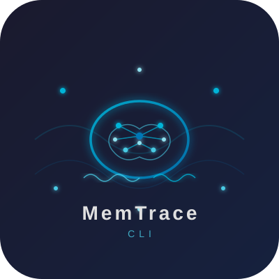

<div align="center">

  

  # MemTrace-CLI

  **Lightweight Terminal AI Agent Shared Memory Engine**

  [](https://www.python.org/downloads/)
  [](https://opensource.org/licenses/MIT)
  [](#)
  [](https://github.com/gitstq/MemTrace-CLI/pulls)
  [](https://github.com/gitstq/MemTrace-CLI)

  *Zero external dependencies  |  Pure Python 3.8+  |  SQLite FTS5  |  Cross-platform*

</div>

---

MemTrace-CLI captures, indexes, and retrieves AI coding agent sessions as persistent, searchable memory. Inspired by the concept of shared agent memory (activeloopai/hivemind), it is reimagined as a lightweight, local-first, cross-platform CLI utility that works entirely on your machine with **zero external dependencies** -- only the Python standard library.

---

## ✨ Features

| Feature | Description |
|---|---|
| **Session Capture** | Wrap any CLI command to automatically record its input, output, and metadata as a structured session |
| **SQLite Persistent Storage** | All sessions, messages, and tags are stored durably in a local SQLite database under `~/.memtrace/` |
| **Full-Text Search** | Blazing-fast search across all captured content via SQLite FTS5 with automatic fallback to LIKE-based search |
| **Tag-Based Organization** | Attach, filter, and browse sessions by tags for effortless categorization |
| **TUI Dashboard** | Interactive terminal dashboard for browsing sessions, searching, and viewing details -- no extra dependencies |
| **Multi-Agent Workspace** | Organize sessions across different agents and workspaces for clean separation of concerns |
| **Export Formats** | Export any session as Markdown, JSON, or plain text for sharing, archiving, or further analysis |
| **Zero External Dependencies** | Pure Python 3.8+ using only `sqlite3`, `argparse`, `json`, and other stdlib modules |
| **Cross-Platform** | Works identically on Linux, macOS, and Windows |
| **Thread-Safe** | SQLite connection managed per-thread with WAL mode for concurrent access |
| **Session Similarity** | Find related sessions based on shared tags and agents |
| **Session Statistics** | Get summary stats on sessions, messages, tokens, active sessions, and database size |

---

## 🚀 Quick Start

### Installation

```bash
# Install from source
git clone https://github.com/gitstq/MemTrace-CLI.git
cd MemTrace-CLI
pip install .

# Verify installation
memtrace --version
```

### Your first session

```bash
# Capture a session by wrapping any command
memtrace capture echo "Hello, MemTrace!" --agent demo

# List captured sessions
memtrace list

# Search across all captured memory
memtrace search "Hello"

# View session details
memtrace show <session-id>
```

### Python API (quick capture)

```python
from memtrace import SessionCapture

# One-liner capture
exit_code = SessionCapture.quick_capture(
    ["claude", "-p", "explain this Python code"],
    agent="claude",
    workspace="my-project",
    tags=["code-review"],
)
```

---

## 📖 Usage Guide

### Global Options

```
--db-dir PATH   Custom database directory (default: ~/.memtrace)
--version       Show version information
```

### `capture` -- Capture an agent session

Wraps a CLI command and records its execution as a searchable session.

```bash
# Basic capture
memtrace capture claude -p "write a fibonacci function"

# With agent and workspace labels
memtrace capture claude -p "refactor this" --agent claude --workspace backend

# With tags
memtrace capture claude -p "review this PR" --tag review --tag urgent
```

**Options:**

| Option | Description |
|---|---|
| `--agent TEXT` | Agent name (default: `cli`) |
| `--workspace TEXT` | Workspace name (default: `default`) |
| `--tag TEXT` | Tag to apply (can be specified multiple times) |

### `search` -- Search across memory

Full-text search across all captured messages with optional filters.

```bash
# Basic search
memtrace search "binary search algorithm"

# Filter by agent and workspace
memtrace search "deploy" --agent claude --workspace backend

# Filter by tag
memtrace search "API" --tag backend

# Limit to recent activity
memtrace search "bug" --days 7

# Limit results
memtrace search "function" --limit 5
```

**Options:**

| Option | Description |
|---|---|
| `query` | Search query (required) |
| `--agent TEXT` | Filter by agent name |
| `--workspace TEXT` | Filter by workspace |
| `--tag TEXT` | Filter by tag |
| `--days INT` | Time range in days (e.g. `7` for last week) |
| `--limit INT` | Max results (default: `20`) |

### `list` -- List recent sessions

```bash
# List all sessions
memtrace list

# Filter by agent
memtrace list --agent claude

# Filter by workspace
memtrace list --workspace backend

# Limit results
memtrace list --limit 5
```

### `show` -- Show session details

```bash
memtrace show <session-id>
```

Displays full session metadata, all messages (with colored role labels), and associated tags.

### `stats` -- Show memory statistics

```bash
memtrace stats
```

Displays a summary dashboard with:
- Total sessions, active sessions, messages, and tokens
- Database size
- Per-agent session counts

### `export` -- Export a session

```bash
# Export as Markdown (default)
memtrace export <session-id>

# Export as JSON
memtrace export <session-id> --format json

# Export as plain text
memtrace export <session-id> --format text

# Write to file
memtrace export <session-id> -o session-export.md
```

Supported formats: `markdown`, `json`, `text`

### `tags` -- List all tags

```bash
memtrace tags
```

Shows all tags with their usage counts across sessions.

### `dashboard` -- Open interactive TUI dashboard

```bash
memtrace dashboard
```

Interactive terminal UI for browsing sessions, searching, and viewing details. Navigate with keyboard commands:

| Key | Action |
|---|---|
| `n` | Next page |
| `p` | Previous page |
| `s` | Search |
| `v` | View session by ID |
| `q` | Quit |

### `delete` -- Delete a session

```bash
# With confirmation prompt
memtrace delete <session-id>

# Skip confirmation
memtrace delete <session-id> --yes
```

---

## 💡 Design Philosophy

MemTrace-CLI is built on a few core principles:

**1. Zero Dependencies, Maximum Portability**

The entire project uses only Python's standard library. No pip installs of SQLAlchemy, Rich, Click, or any other third-party package. SQLite (including FTS5) is bundled with Python. This means MemTrace-CLI works on any machine with Python 3.8+ -- immediately, with no setup friction.

**2. Local-First, Privacy-Respecting**

All data lives on your machine in `~/.memtrace/memory.db`. No cloud synchronization, no telemetry, no data leaves your system. Your agent sessions stay yours.

**3. Simple and Composable**

The CLI follows Unix philosophy: one tool, one job. Each command does one thing well, and they compose naturally. The Python API mirrors the CLI exactly, so you can use MemTrace-CLI interactively or programmatically.

**4. Inspired by Shared Agent Memory**

Inspired by activeloopai/hivemind's vision of shared agent memory, MemTrace-CLI implements the same concept in a radically simpler form: a local SQLite database with FTS5 search, tag-based organization, and a clean CLI interface.

---

## 📦 Project Structure

```
MemTrace-CLI/
├── assets/
│   └── logo.svg                      # Project logo
├── memtrace/
│   ├── __init__.py                   # Package init, version, public API exports
│   ├── cli.py                        # CLI entry point (argparse dispatcher)
│   ├── store.py                      # MemoryStore — SQLite backend with FTS5
│   ├── session.py                    # SessionCapture — session lifecycle & CLI wrapper
│   ├── search.py                     # MemorySearch — search, filter, export engine
│   ├── tui.py                        # Terminal UI dashboard (ANSI rendering)
│   └── utils.py                      # Shared utilities (tokens, timestamps, etc.)
├── tests/
│   └── test_core.py                  # 22 passing tests
├── __main__.py                       # python -m memtrace entry point
├── setup.py                          # Legacy setuptools configuration
├── pyproject.toml                    # Modern build configuration
├── Makefile                          # Development workflow targets
└── README.md                         # This file
```

### Core Modules

| Module | Class / Entry | Responsibility |
|---|---|---|
| `memtrace/store.py` | `MemoryStore` | SQLite database management, session CRUD, messaging, tags, FTS5 search, statistics |
| `memtrace/session.py` | `SessionCapture` | Session lifecycle (start/stop/log), CLI command wrapping, context manager, auto-summarization |
| `memtrace/search.py` | `MemorySearch` | Advanced search with multi-filter queries, tag/agent/time filtering, session export (Markdown/JSON/text), similarity finding |
| `memtrace/tui.py` | Renderers + Dashboard | ANSI terminal rendering, paginated session browser, interactive dashboard loop |
| `memtrace/cli.py` | `main()` | Argument parsing, subcommand dispatch, help text |
| `memtrace/utils.py` | Utility functions | Token estimation, content type detection, safe JSON parsing, platform-aware paths |

---

## 🤝 Contributing

Contributions are welcome and appreciated! Here is how you can help:

### Getting Started

```bash
# Clone the repository
git clone https://github.com/gitstq/MemTrace-CLI.git
cd MemTrace-CLI

# Install in development mode
make install

# (Optional) Install dev dependencies and run tests
make dev
make test
```

### Development Workflow

```bash
make dev          # Install with test dependencies
make test         # Run full test suite (22 tests)
make test-cov     # Run tests with coverage report
make smoke        # Quick smoke test
make lint         # Syntax check all modules
make clean        # Clean build artifacts
make build        # Build distribution packages
```

### Guidelines

- **Keep it zero-dependency:** Do not introduce external packages. If the stdlib cannot do what you need, reconsider the approach.
- **Maintain cross-platform compatibility:** Test on Linux and (if possible) macOS/Windows.
- **Write tests:** All new functionality should come with corresponding tests.
- **Keep it simple:** The project values clarity and minimalism over clever abstractions.

---

## 📄 License

MemTrace-CLI is released under the **MIT License**. See [LICENSE](LICENSE) for the full text.

```
MIT License

Copyright (c) 2025 MemTrace Team

Permission is hereby granted, free of charge, to any person obtaining a copy
of this software and associated documentation files (the "Software"), to deal
in the Software without restriction, including without limitation the rights
to use, copy, modify, merge, publish, distribute, sublicense, and/or sell
copies of the Software, and to permit persons to whom the Software is
furnished to do so, subject to the following conditions:

The above copyright notice and this permission notice shall be included in all
copies or substantial portions of the Software.

THE SOFTWARE IS PROVIDED "AS IS", WITHOUT WARRANTY OF ANY KIND, EXPRESS OR
IMPLIED, INCLUDING BUT NOT LIMITED TO THE WARRANTIES OF MERCHANTABILITY,
FITNESS FOR A PARTICULAR PURPOSE AND NONINFRINGEMENT. IN NO EVENT SHALL THE
AUTHORS OR COPYRIGHT HOLDERS BE LIABLE FOR ANY CLAIM, DAMAGES OR OTHER
LIABILITY, WHETHER IN AN ACTION OF CONTRACT, TORT OR OTHERWISE, ARISING FROM,
OUT OF OR IN CONNECTION WITH THE SOFTWARE OR THE USE OR OTHER DEALINGS IN THE
SOFTWARE.
```

---

<div align="center">
  <sub>Built with Python and SQLite. Inspired by activeloopai/hivemind.</sub>
</div>